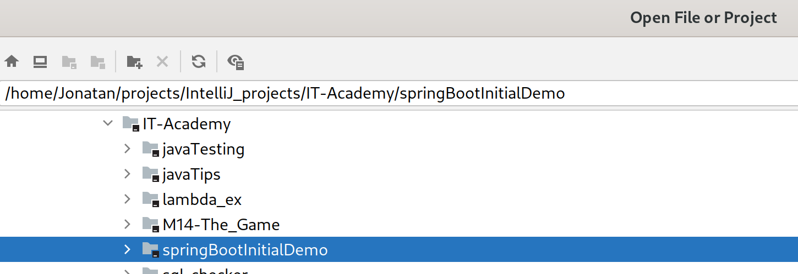
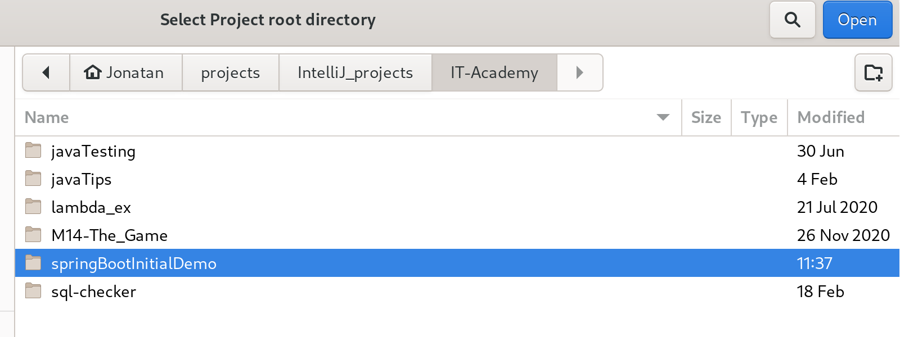

## Java Testing Project

This project contains basic structure to work with Java testing libraries JUnit, AssertJ and Hamcrest.
As you can see, folder structure is empty. Only contains preconfiguration and folders structure to allows extends with
your own developments.

### Included configuration

This is a Gradle Project with Java standard structure. You can see longer explanation of this topic or how organize
your Gradle projects in **[Official Gradle Documentation](https://docs.gradle.org/current/userguide/organizing_gradle_projects.html).**

Main configuration are located in build.gradle, but each module contains its own file build.gradle that imports its own dependencies
to compile, build or test developments.

So, for example, you can see at **build.gradle** of **Junit module**:
```
dependencies {
    testCompile group: 'org.assertj', name: 'assertj-core', version: '3.19.0'
    testCompile group: 'junit', name: 'junit', version: '4.13.1'
    testCompile group: 'org.hamcrest', name: 'hamcrest-all', version: '1.3'
}
```

All necessary dependencies are included in the respective modules.

### Executing the tests

You can run **all modules** executing Gradle **run** task, or test with **test** task, by command line or using your IDE.
By command-line, you have to execute:

- Linux / macOS
``` 
 ./gradlew test
```
- Windows
```
gradlew.bat test
```

You can run each module separately invocating:

- Linux / macOS
``` 
 ./gradlew :[moduleName]:test
```
- Windows
```
gradlew.bat :[moduleName]:test
```


### Modules

- Junit v.4.13. See [Official Docs](https://junit.org/junit4/).
- AssertJ v. 3.19. See [Official Docs](https://assertj.github.io/doc/).
- Hamcrest v. 1.3. See [Official Docs](http://hamcrest.org/JavaHamcrest/). 


### Import project to IntelliJ

Follow next steps:
- Open IntelliJ.
  

- Select **Open** option.
  

- Navigate to the folder containing the project.
  

### Import project to Eclipse
- Navigate to menu File > Import
  

- Select Gradle / Existing Gradle Project and press 'Next'
  

- Select Project Root Directory as images below shown, and press 'Finish'
  


- Now you can see the workspace with the project ready to work
  


[](code_of_conduct_EN.md)
[](code_of_conduct_ES.md)
[](code_of_conduct_CA.md) 
